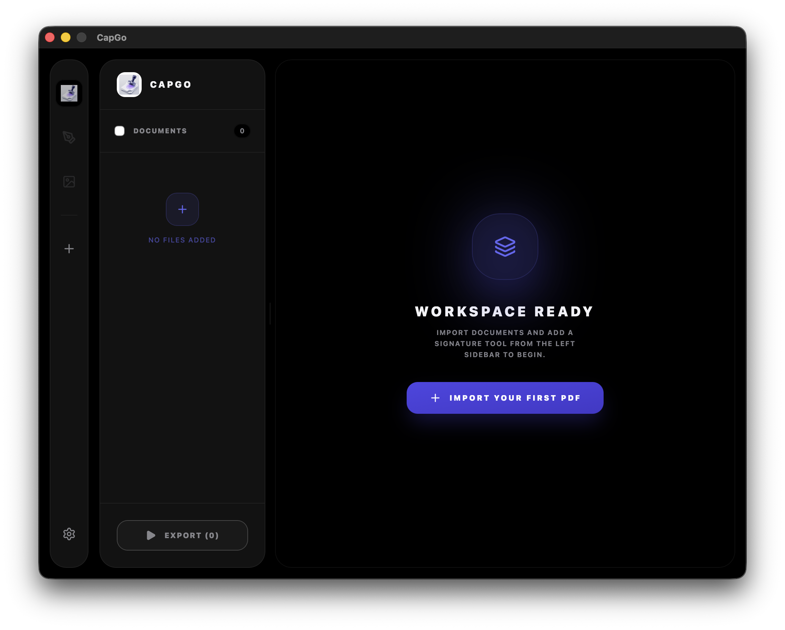

# CapGo 🖊️ 📄

**CapGo** is a fast, modern, and beautiful desktop application for macOS designed to help you stamp and sign PDF documents with zero effort.

Whether you're a professional handling hundreds of invoices or just need to sign a quick form, CapGo makes the process seamless, secure, and satisfying.

---

---

## 📥 Get Started

Ready to start stamping? Download the latest version for macOS:

1.  **[Download CapGo Installer (.dmg)](https://github.com/Lelehuy/CapGo/releases/latest)**
2.  Open the downloaded file and **drag CapGo** to your Applications folder.
3.  Launch **CapGo** from your Applications and you're ready to go!

---

## ✨ Features that Make Work Easy

- **🚀 Drag & Drop**: Just drop your PDF and your stamp image. No complex menus.
- **🎯 Precise Placement**: Move and resize your stamp directly on a live preview of your document.
- **⚡ Batch Processing**: Set one stamp layout and apply it to an entire folder of PDFs in seconds.
- **📄 Multi-page Support**: Different stamps for different pages? No problem.
- **🛡️ 100% Private**: Your documents never leave your computer. All processing happens locally on your machine.
- **🌙 Premium Dark UI**: A sleek, modern design that's easy on the eyes and looks great on macOS.

---

## 📖 How to Use

1.  **Add Your PDF**: Click the "Add PDF" area or drag a file in.
2.  **Add Your Stamp**: Upload your signature or official stamp image (PNG with transparency works best!).
3.  **Position & Resize**: Drag the stamp to where you want it on the page. Use the corners to resize.
4.  **Process**: Click "Apply Stamp" and CapGo will generate your signed document instantly.

---

## 🔄 Stay Updated

CapGo is constantly improving. To check for the latest features:

- Click the **CapGo** title in the app to see the "About" section.
- Use the **"Check for Update"** button to automatically download the newest version.

---

## 📄 License & Privacy

CapGo is **Open Source** software licensed under the [GNU General Public License v3.0](LICENSE).
Your privacy is our priority: Your files are processed locally and are never uploaded to any server.

---

_Developed with ❤️ for productivity by [Lelehuy](https://github.com/Lelehuy)._

> **Are you a developer?** Check out our [Development Guide](./DEVELOPMENT.md) for build instructions and project structure.
